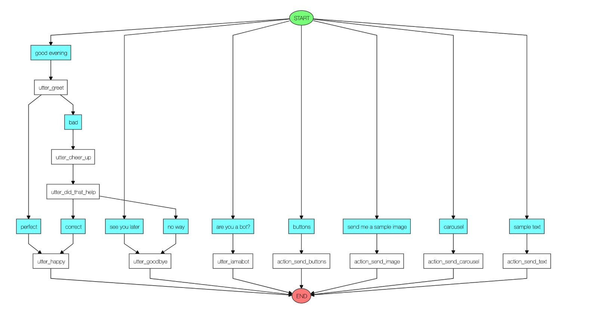

# A sample RASA chatbot built using MACHAAO Platform
This RASA based NLU chatbot intends to showcase various RCS-esque messaging options available on the Machaao Platform



## Requirements ##
* Download or clone this repository
           
* Get an api token via https://messengerx.io and place in the credential.yml
```
  connectors.MachaaoConnector.MachaaoInputChannel:
    api_token: <YOUR API-TOKEN>
    base_url: "https://ganglia-dev.machaao.com"
```

## Train the sample model ##
Train your RASA model based on the sample set in the "data" folder
```
	rasa train nlu 
```
## Start the RASA Action Service ##
Start your the action service either in a separate terminal or in the same tab as a background process.<br>

* In a separate terminal:
```
	rasa run actions
```

* As a background process:
```
	rasa run actions &
```
<br>

## Start RASA Core Service ##
Start rasa core and specify the custom connector.<br>
```
	rasa run -m models --enable-api --cors “*” --connector connectors.MachaaoConnector.MachaaoInputChannel
```

## Install NGROK - For Dynamic DNS (Required) ##
* Install ngrok for your OS via https://ngrok.com/download, and place it in the project directory.<br>

* Run ngrok on port 5005 with the following command, and note the generated https url.<br>

```
	ngrok http 5005
```

## Deploying your bot on a Heroku server (Optional) ##

* Apply for an api token from the machaao team and place it in the credential.yml.
* Sign up for free on Heroku.
* Create a new app on Heroku and note down the app name.
* Use the docker image supplied as part for this project.

```
	docker build -t herokurasa .
```

* Push and deploy the docker image to Heroku.
```
	heroku container:push web -a <Your App Name>
	heroku container:push release -a <Your App Name>
```

## Update your webhook ##
You need a MACHAAO Mini Apps API Token to access the calls and run the sample bot
```
	curl --location --request POST 'https://ganglia-dev.machaao.com/v1/bots/<YOUR API-TOKEN> \
	--header 'api_token: <YOUR API-TOKEN>' \
	--header 'Content-Type: application/json' \
	--data-raw '{
		"url": "<YOUR URL>/webhooks/machaao/incoming",
		"description": "<YOUR BOT DESCRIPTION>",
		"displayName": "<YOUR BOT NAME>"
	}'
```
